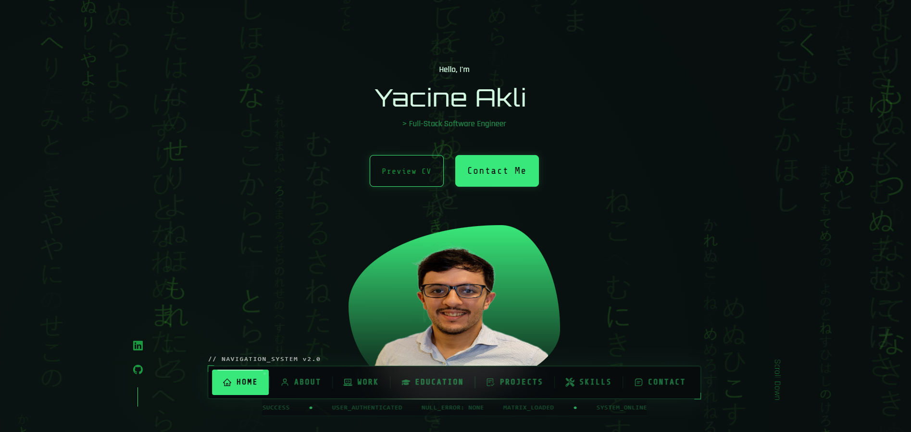

# Portfolio Developer

Portfolio personnel développé avec React, TypeScript et Vite.

Ce projet présente mon profil, mes compétences, mes projets et un moyen de contact direct via formulaire.

## Aperçu



Le portfolio a été conçu avec une interface moderne, responsive et animée afin d’offrir une expérience utilisateur fluide sur desktop et mobile.

## Fonctionnalités

- Présentation personnelle
- Section projets
- Téléchargement du CV
- Interface responsive
- Animations et transitions
- Formulaire de contact
- Design moderne et minimaliste

## Technologies utilisées

- React
- TypeScript
- Vite
- CSS
- EmailJS

## Installation

Cloner le projet :

```bash
git clone git@github.com:yacineak97/portfolio.git
```

Accéder au dossier :

```bash
cd portfolio
```

Installer les dépendances :

```bash
npm install
```

Lancer le serveur de développement :

```bash
npm run dev
```

## Build production

```bash
npm run build
```

## Déploiement

Le projet peut être déployé facilement avec GitHub Pages, Vercel ou Netlify.

## Structure du projet

```bash
src/
 ├── assets/
 ├── components/
 ├── App.tsx
 └── main.tsx
```

## Objectif du projet

Ce portfolio a été réalisé afin de mettre en avant mes compétences en développement front-end et ma capacité à créer des interfaces modernes et responsives.

## Auteur

Yacine Akli
